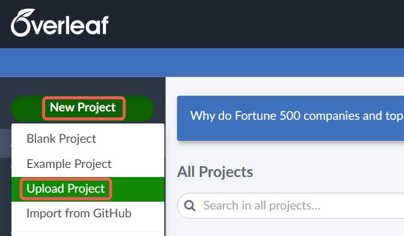
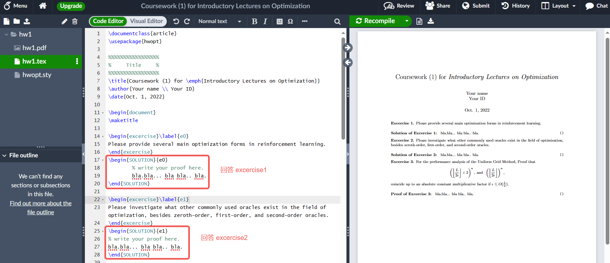

# 作业环境

!!! info "强烈推荐使用 LaTeX，但也不排斥其他能看清楚的 PDF"

## 非 LaTeX 的选择

> 希望大家尽量使用 LaTeX 完成作业，作业难度不高，可以作为一个不错的练习，也为期末大作业和毕业设计做准备。如果实在存在困难，也希望能尽量让我能够看清楚，参考以下的说明。

- Markdown: 简洁干净，同样使用数学公式环境
    - 推荐 VSCode 配合 Markdown Preview Enhanced 插件，预览的 PDF 在浏览器打开后打印就可以导出为 PDF
    - 或者也可以使用 Typora。
- 排版优良的 Microsoft Word: 使用内置的数学公式输入，导出为 PDF
- 手写拍照：希望能够扫描锐化一下，比如使用扫描全能王，然后转为 PDF
    - 选择 Markdown 和 Word 但是选择插入图片的话，也希望能够拍清楚

## LaTeX 环境配置

本地 LaTeX 可以自行搜索教程进行配置，给出一篇可以参考的知乎文章：[使用 VSCode 编写 LaTeX](https://zhuanlan.zhihu.com/p/38178015)。

下面给出可以尽快上手的在线 LaTeX 编辑：[Overleaf](https://www.overleaf.com/)，注册登录后选择 New Project - Upload Project，然后将附件中老师所提供的 hw1.zip 拖入上传框就可以创建项目 hw1。

随后在 SOLUTION 环境中就可以对每个 excercise 进行作答了。

